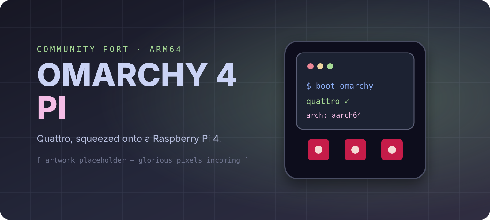

<div align="center">
  

  # Omarchy 4 Pi

  **The delightfully opinionated Omarchy Quattro desktop, remixed for Raspberry Pi 4.**

  [](#project-status)
  [](https://github.com/pkyanam/omarchy-4-pi/actions/workflows/pi-checks.yml)
  [](https://github.com/pkyanam/omarchy-4-pi/releases)
  [](#what-you-need)
  [](#how-it-works)
  [](LICENSE)

  *Tiny board. Big desktop energy.*
</div>

> [!IMPORTANT]
> This is an independent community port and is not an official Omarchy or Raspberry Pi product. The first image now boots to Omarchy's HDMI setup splash on a real Pi 4; owner setup, Quattro, and V3D verification are still in progress. Treat artifacts as alpha until the [hardware checklist](https://github.com/pkyanam/omarchy-4-pi/issues/1) is green.

## The destination

Pick an image in Raspberry Pi Imager, flash it, boot the Pi, answer a few friendly setup questions, and land in the full Omarchy 4 “Quattro” desktop: Hyprland, the Quickshell bar and launcher, themes, hotkeys, Chromium, terminal tooling, and the unusually pleasant details that make Omarchy feel like Omarchy.

The finished release flow will look like this:

```text
Raspberry Pi Imager → Choose OS → Use custom → omarchy-4-pi-*.img.xz → Write → Boot → ✨
```

Each GitHub release is intended to provide a compressed flashable image, SHA-256 checksum, build manifest, and human-readable release notes. The same image must also be reproducible from this repository.

## Project status

| Piece | Status | Notes |
|---|---:|---|
| Quattro ARM64 package audit | ✅ | Hyprland and Quickshell are available in Arch Linux ARM |
| Pi 4 hardware detection | ✅ | Device-tree based, with focused tests |
| VC4/V3D graphics setup | ✅ | Full KMS, Broadcom Vulkan, Aquamarine compatibility setting |
| ARM-safe package lifecycle | ✅ | Arch Linux ARM mirrors survive install, refresh, and update flows |
| In-place Arch Linux ARM installer | 🧪 | Implemented; real-hardware soak testing pending |
| Reproducible `.img` builder | ✅ | First end-to-end native ARM64 build passed with signed-base verification, manifests, compression, and checksums |
| Real Pi 4 boot + HDMI splash | ✅ | Alpha image reached Omarchy's first-boot greeter on hardware |
| Automatic storage expansion | ✅ | Root partition and ext4 filesystem grow before onboarding |
| First-boot owner setup | 🧪 | Greeter verified on real Pi 4; keyboard-driven completion is pending |
| Quattro desktop + V3D on hardware | 🧪 | Pending completion of the first owner setup |
| Raspberry Pi Imager metadata | ✅ | Catalog generator emits exact compressed and extracted SHA-256 hashes |
| First prebuilt image prerelease | 🧪 | [Alpha release](https://github.com/pkyanam/omarchy-4-pi/releases/tag/v0.1.0-alpha.1) publishes the successful image as checksummed release parts |
| Public Imager catalog URL | ⏳ | Activates when the first release artifact is hosted |

Legend: ✅ implemented and locally verified · 🧪 ready for hardware testing · 🚧 being built · ⏳ queued

## What you need

- Raspberry Pi 4 Model B — the 8 GB model is nicest, 4 GB is supported as a target
- 32 GB or larger microSD card; a USB 3 SSD is strongly recommended
- The official-quality 5 V / 3 A power supply
- HDMI display, keyboard, and network access for first boot
- A taste for tiling windows on improbably small computers

## Try it today

### Build a flashable image

The supported factory runs on an aarch64 Linux host with loop-device support. The easiest route is **Actions → Build Raspberry Pi image → Run workflow** in this repository; it uses GitHub's native ARM64 runner and returns an `.img.xz`, checksum, build manifest, and Raspberry Pi Imager catalog as one workflow artifact.

To build locally on an ARM64 Linux machine:

```bash
sudo apt-get install libarchive-tools dosfstools e2fsprogs gnupg parted rsync xz-utils
sudo image/build-rpi4-image.sh --minimal
```

On an Apple-silicon Mac with Docker Desktop running, use the native ARM64 helper:

```bash
image/build-rpi4-image-macos.sh --minimal
```

It uses all but two Mac cores by default, keeps build I/O inside Docker's Linux filesystem, and selects fast xz compression. Set `OMARCHY_LOCAL_CPUS=8` to choose an explicit core count or `OMARCHY_XZ_PRESET=-6` for a smaller, slower artifact.

Artifacts land in `build/image/`. In Raspberry Pi Imager, choose **Use custom**, select the `.img.xz`, and write it to a 32 GB or larger card/SSD. On first boot, Omarchy expands the filesystem, asks you to create the owner account, and then opens Quattro. The factory removes Arch Linux ARM's default `alarm` account and locks the default root password before compression.

`--full` adds the optional ARM-buildable Omarchy applications. It is slower and considerably larger; the minimal image already contains the complete desktop shell, browser, terminal, file manager, developer tools, theming, and core commands.

Routine builds use balanced multithreaded xz compression. Set `OMARCHY_XZ_PRESET=-9e` (or choose **maximum** in Actions) when a release needs the smallest possible download and extra build time is acceptable.

### Install onto an existing Arch Linux ARM system

Start with the official [Arch Linux ARM aarch64 Raspberry Pi 4 root filesystem](https://archlinuxarm.org/platforms/armv8/broadcom/raspberry-pi-4), create a regular sudo-capable user, then run:

```bash
git clone https://github.com/pkyanam/omarchy-4-pi.git ~/omarchy-4-pi
cd ~/omarchy-4-pi
./install-rpi4.sh
```

For the complete Quattro shell without compiling the optional application bundle:

```bash
./install-rpi4.sh --minimal
```

The full walkthrough, verification commands, update behavior, limitations, and black-screen recovery notes live in [the Raspberry Pi 4 install guide](docs/raspberry-pi-4.md).

## How it works

Upstream Omarchy Quattro is package-backed and its ISO follows an x86_64 boot path. The Omarchy packages themselves are architecture-independent, but the public stable package repository currently has no aarch64 tree. This project bridges that gap without pretending the Pi is a PC:

```text
Arch Linux ARM aarch64 base
├── Raspberry Pi firmware + U-Boot boot path (kept intact)
├── VC4 KMS + V3D Mesa graphics
├── Hyprland + Quickshell from Arch Linux ARM
├── ARM-compatible apps from upstream Omarchy PKGBUILDs
└── Omarchy Quattro core, built locally without Limine dependencies
```

The port also teaches the normal Omarchy update, channel, snapshot, and package-refresh commands about the Pi. That matters: a desktop that boots once but replaces its ARM repositories with x86 mirrors during the first update is not a port; it is a very elaborate practical joke.

## Pi-friendly quality of life

The image roadmap includes more than “make it boot”:

- zram tuned for the Pi's smaller memory ceiling
- first-boot user, locale, timezone, Wi-Fi, and hostname setup
- SSH opt-in with a clear security posture
- grow the root filesystem automatically on first boot
- power/thermal/undervoltage status surfaced in diagnostics
- sensible 1080p defaults with expensive blur and animation options documented
- CPU-friendly `wf-recorder` capture at 30 fps
- SD-card-write reduction for logs, caches, and browser churn
- safe headless recovery when the graphical session cannot start
- build manifests that record every upstream commit and package version

Suggestions are welcome—especially the small, obvious-in-retrospect touches that make a Pi feel like an appliance instead of a weekend of Linux archaeology.

## Build philosophy

The image builder is boring in the best way:

1. Download the official Arch Linux ARM Raspberry Pi 4 root filesystem and detached signature.
2. Verify that signature against Arch Linux ARM's published build-key fingerprint before touching it.
3. Assemble an MBR image on a native aarch64 Linux host with loop-device support.
4. Install pinned Omarchy sources and the ARM package set.
5. Remove factory credentials, blank machine identity and SSH host keys, then arm storage expansion and owner onboarding.
6. Compress the image and emit exact hashes, a provenance manifest, and schema-compatible Raspberry Pi Imager metadata.
7. Boot-test the artifact, then verify graphics and input on a real Pi 4.

No mystery blobs will be generated by CI. Every release artifact should be traceable back to a workflow run and the exact source revisions used to build it.

## Development

Run the focused Pi tests on any Unix-like development machine:

```bash
test/shell.d/raspberry-pi-test.sh
```

Run the inherited Omarchy CLI and shell suites before merging broader changes:

```bash
./test/all
```

Real-hardware acceptance remains the final word for HDMI scan-out, V3D acceleration, audio, Bluetooth, Wi-Fi, suspend behavior, and thermal stability. Test reports should include the Pi revision, RAM size, boot medium, display mode, power supply, and output from `omarchy-debug`.

## Known gaps

- The first complete `.img.xz` exceeds GitHub Releases' per-file limit, so the [alpha release](https://github.com/pkyanam/omarchy-4-pi/releases/tag/v0.1.0-alpha.1) provides numbered parts, part checksums, and reassembly instructions. A one-file public Imager catalog URL still needs large-file hosting.
- The stock ext4 image has no Snapper rollback or factory reset.
- A few x86-only or unavailable apps are omitted; the core Quattro experience does not depend on them.
- High-resolution video recording and heavy Electron multitasking can overwhelm a Pi 4.
- Hardware verification has not yet covered every Pi revision, DSI panel, HAT, or USB boot enclosure.

## Credits

Built on [Omarchy](https://github.com/omacom/omarchy) by DHH and its contributors, [Arch Linux ARM](https://archlinuxarm.org/), [Hyprland](https://hypr.land/), [Quickshell](https://quickshell.org/), and the enormous body of Raspberry Pi kernel and Mesa work that makes a modern Wayland desktop on this board possible.

Omarchy is MIT-licensed. This port keeps that license and upstream attribution.
